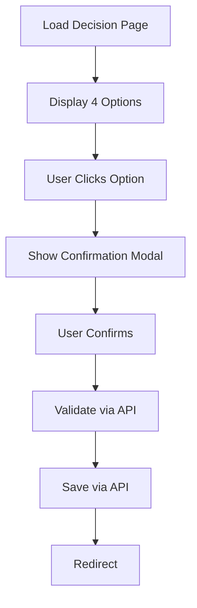
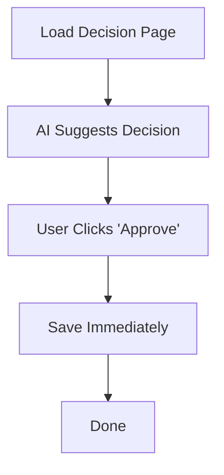

# Three-Document System - النظام الوثائقي الثلاثي

## النظرة العامة

كل تغيير تصميمي يُدار عبر **3 وثائق فقط**، كل واحدة لها دور محدد ومكان محدد:

```
1. Design Finding      → يكتشف المشكلة
2. Logic Impact Note   → يحلل التأثير
3. Decision Record     → يقرر التنفيذ
```

**القاعدة الذهبية:**
> لا يُنفذ أي تغيير في Backend إلا بعد مرور الوثائق الثلاث بالترتيب.

---

## 📋 الوثيقة الأولى: Design Finding

### متى تُكتب؟

عندما تلاحظ في DesignLab:
- المستخدم يتعثر
- الخطوات أكثر من اللازم
- التصميم الأفضل **غير ممكن** بالمنطق الحالي

**ليس:** "التصميم أجمل"  
**بل:** "التصميم أفضل **لكن المنطق يمنعه**"

### الهدف

إثبات وجود **احتكاك حقيقي** بين UX والمنطق، ليس مجرد ذوق شخصي.

### الشكل القياسي

```markdown
# Design Finding

**ID:** DF-001  
**Date:** 2025-12-21  
**Source:** DesignLab Experiment "ai-first-v2"

## Observation

المستخدم يُجبر على:
- الدخول لصفحة القرار
- مراجعة 4 خيارات
- النقر على "اختيار"
- تأكيد الاختيار في modal منفصل
- حفظ

**المجموع:** 5 خطوات، 4 نقرات، ~120 ثانية

## Why This Is a Problem

- **Cognitive Overhead:** المستخدم يعرف القرار من البداية (AI تقترح 95%)
- **Wasted Time:** 3 خطوات زائدة لا تضيف قيمة
- **Friction:** كل خطوة = فرصة للتشتت أو الخطأ

## UX Impact (Measured)

| Metric | Current | Desired | Gap |
|--------|---------|---------|-----|
| Time | 120s | <30s | -75% |
| Clicks | 4 | 1 | -75% |
| Cognitive Load | High | Low | Major |

## Design Blocker

**لا يمكن تحقيق القفز المباشر** لأن:
- Backend يتوقع تمرير كل الخطوات
- Validation مبعثر عبر 3 endpoints
- Session state يعتمد على التسلسل

## What We Need

**لكي ينجح التصميم الجديد:**
Backend يجب أن يدعم: "Decision in one action"

---

**Status:** Documented  
**Next:** Logic Impact Analysis Required
```

### ⚠️ ما لا تحتويه Design Finding

- ❌ لا حل تقني مقترح
- ❌ لا تعديلات على الكود
- ❌ لا قرارات
- ✅ فقط: إثبات المشكلة + قياس التأثير

### 📁 المكان

```
design-lab/
└─ findings/
   └─ DF-001-decision-flow-friction.md
```

---

## ⚖️ الوثيقة الثانية: Logic Impact Note

### متى تُكتب؟

**بعد** Design Finding، عندما تتأكد:
> "المشكلة حقيقية ولا يمكن حلها بالواجهة فقط"

### الهدف

الإجابة على سؤال واحد فقط:
> **ما الذي يجب أن يتغير في المنطق لكي ينجح التصميم؟**

### الشكل القياسي

```markdown
# Logic Impact Note

**ID:** LIN-001  
**Related Design Finding:** DF-001  
**Date:** 2025-12-21  
**Analyst:** Bakheet

## Current Logic (As-Is)



**Key Dependencies:**
- Decision requires manual selection
- Confirmation requires separate modal
- Validation is separate from save

## Design Requirement (To-Be)



**What Changes:**
- Decision can be implicit (pre-filled by AI)
- Confirmation can be skipped (trust AI)
- Validation must be inline with save (one call)

## Required Backend Changes

### Change 1: Merge Validation & Save

**Current:**
```
POST /api/decisions/validate.php
POST /api/decisions/save.php
```

**Required:**
```
POST /api/decisions/save.php
  - Validation happens internally
  - Returns success/error in one round-trip
```

**Impact:** Type B (Behavioral Change)

### Change 2: Support Pre-filled Decisions

**Current:**
```php
// Backend expects user_selected = true
if (!$_POST['user_selected']) {
    throw new Error("Decision must be manually selected");
}
```

**Required:**
```php
// Accept AI suggestions
if ($_POST['source'] === 'ai_suggestion') {
    // Validate AI suggestion is valid
    // Proceed
}
```

**Impact:** Type A (Logic Addition - backward compatible)

### Change 3: Optional Confirmation

**Current:**
```php
// Confirmation is required
if (!$_POST['confirmed']) {
    return ['status' => 'needs_confirmation'];
}
```

**Required:**
```php
// Confirmation is optional (feature flag)
if (FEATURE_SKIP_CONFIRMATION && $_POST['source'] === 'ai_suggestion') {
    // Skip confirmation
} else {
    // Original flow
}
```

**Impact:** Type A (Feature Flag - no breaking change)

## Impact Classification

| Area | Level | Reason |
|------|-------|--------|
| Database | None | No schema changes |
| API | Medium | Endpoint behavior changes |
| Business Logic | Low | Adds path, doesn't remove existing |
| Security | None | Same validation rules apply |
| Performance | None | Fewer calls = faster |

**Overall Risk:** **MEDIUM**

## Edge Cases to Handle

1. **AI Suggestion is Wrong**
   - User can always override manually
   - Fallback to original 4-option flow

2. **Backend Unavailable**
   - Feature flag auto-disables
   - Falls back to current flow

3. **Validation Fails**
   - Clear error message
   - Allow retry

## Dependencies

**None** - This is self-contained logic change.

## Testing Requirements

- [ ] Unit tests for new API behavior
- [ ] Integration tests for AI → Save flow
- [ ] Regression tests for manual flow
- [ ] Feature flag toggle tests

## Rollback Plan

```php
// config/features.php
define('FEATURE_QUICK_DECISION', false); // ← Instant rollback
```

Falls back to current flow immediately.

---

**Status:** Analyzed  
**Risk:** Medium  
**Next:** Awaiting Decision Record
```

### ⚠️ ما لا تحتويه Logic Impact Note

- ❌ لا كود فعلي (فقط pseudo-code توضيحي)
- ❌ لا قرار (موافق/مرفوض)
- ❌ لا تنفيذ
- ✅ فقط: تحليل دقيق للتأثير

### 📁 المكان

```
logic-impact/
├─ proposals/
│  └─ LIN-001-quick-decision-flow.md
└─ approved/
   └─ [يُنقل هنا بعد الموافقة]
```

---

## ✅ الوثيقة الثالثة: Decision Record

### متى تُكتب؟

**بعد** مراجعة Logic Impact Note، عندما:
> "حان وقت القرار النهائي: نفذ، ارفض، أو أجّل"

### الهدف

**إغلاق الجدل** بقرار رسمي موثق.

### الشكل القياسي

```markdown
# Decision Record

**ID:** DR-001  
**Related:** LIN-001, DF-001  
**Date:** 2025-12-21 18:15

## Proposal Summary

Enable "Quick Decision" flow: User approves AI suggestion in one click.

## Decision

**✅ APPROVED** with conditions

## Rationale

**Why Approve:**
- UX improvement is massive (-75% time, -75% clicks)
- Risk is medium and manageable
- Backward compatible (feature flag)
- Rollback is instant

**Why Not Reject:**
- The problem is real (proven by metrics)
- Current flow wastes 90 seconds per decision × 30 decisions/day = 45 minutes/day

**Why Not Defer:**
- Analysis is complete
- Risk is acceptable
- ROI is clear

## Conditions for Approval

1. **Must use Feature Flag**
   ```php
   FEATURE_QUICK_DECISION = false (start disabled)
   ```

2. **Must have Rollback Plan**
   - One-click disable via flag
   - Falls back to current flow

3. **Must pass Testing**
   - Unit + Integration + Regression
   - User acceptance test (internal)

4. **Must be Monitored**
   - Error rate < 1%
   - Decision time actually decreases
   - User feedback > 8/10

## Implementation Approval

**Approved by:** Bakheet  
**Date:** 2025-12-21  
**With conditions above**

## Next Steps

1. Create Execution Plan (from Logic Impact Note)
2. Implement changes with feature flag
3. Test thoroughly
4. Enable for test users
5. Monitor 48 hours
6. Full rollout if metrics hold

## Rollback Trigger

If **any** of these occur:
- Error rate > 1%
- User complaints > 5%
- Decision time doesn't improve
- Manual override by owner

**Rollback Action:**
```php
define('FEATURE_QUICK_DECISION', false);
```

---

**Status:** APPROVED  
**Ready for:** Backend Implementation  
**Owner:** Bakheet
```

### ⚠️ ما لا تحتويه Decision Record

- ❌ لا تفاصيل تقنية (موجودة في Logic Impact Note)
- ❌ لا كود
- ✅ فقط: قرار واضح + شروط + مسؤولية

### 📁 المكان

```
logic-impact/
└─ approved/
   └─ DR-001-quick-decision-approved.md
```

---

## 🗂️ البنية الكاملة للمسارات

```
project/
├── design-lab/                    # المختبر
│   ├── findings/                  # المشاكل المكتشفة
│   │   ├── DF-001-decision-flow-friction.md
│   │   ├── DF-002-timeline-hidden.md
│   │   └── ...
│   ├── experiments/               # التجارب
│   │   ├── ai-first-v2.php
│   │   └── ...
│   └── metrics/                   # القياسات
│       └── ai-first-v2-metrics.json
│
├── logic-impact/                  # التحليل والقرارات
│   ├── proposals/                 # قيد التحليل
│   │   ├── LIN-001-quick-decision.md
│   │   ├── LIN-002-inline-timeline.md
│   │   └── ...
│   ├── approved/                  # الموافق عليها
│   │   ├── DR-001-quick-decision-approved.md
│   │   └── ...
│   └── rejected/                  # المرفوضة (للتعلم)
│       └── DR-XXX-rejected.md
│
└── backend-changes/               # التنفيذ الفعلي
    ├── feature-flags/
    │   └── quick-decision.php
    ├── api/
    │   └── decisions/
    │       └── save.php (modified)
    └── migrations/
        └── (إذا احتاج DB changes)
```

---

## 🔄 العلاقة بين المسارات

| المسار | الدور | يحتوي على | القرارات |
|--------|-------|------------|-----------|
| **design-lab/** | الاكتشاف فقط | تجارب، مشاكل، metrics | ❌ لا |
| **logic-impact/** | التحليل والقرار | تحليل تقني، قرارات | ✅ نعم |
| **backend-changes/** | التنفيذ فقط | كود، migrations، flags | ❌ لا |

### القواعد الصارمة

```
✅ design-lab → logic-impact → backend-changes  (التدفق الصحيح)

❌ design-lab → backend-changes               (ممنوع - تجاوز التحليل)
❌ logic-impact → logic-impact                (ممنوع - قرار يغير قرار)
❌ backend-changes → design-lab               (ممنوع - عكس التدفق)
```

---

## 📊 مثال كامل للتدفق

### الأسبوع 1: Discovery

```bash
# في DesignLab
1. تجربة ai-first-v2
2. قياسات تظهر: 75% تحسن لكن المنطق يمنع
3. كتابة: design-lab/findings/DF-001-decision-flow-friction.md
```

### الأسبوع 2: Analysis

```bash
# في logic-impact
4. تحليل: logic-impact/proposals/LIN-001-quick-decision.md
5. تقييم المخاطر: Medium
6. تحديد التغييرات المطلوبة
```

### الأسبوع 2 (نهاية): Decision

```bash
# في logic-impact
7. مراجعة التحليل
8. كتابة قرار: logic-impact/approved/DR-001-quick-decision-approved.md
9. الموافقة بشروط (feature flag, monitoring, etc)
```

### الأسبوع 3: Implementation

```bash
# في backend-changes
10. تطبيق التغييرات مع feature flag
11. الاختبار
12. التفعيل التدريجي
13. المراقبة
```

### الأسبوع 4: Monitoring

```bash
14. قياس النتائج الفعلية
15. مقارنة مع التوقعات
16. قرار: استمرار أو rollback
```

---

## ✅ Checklist للالتزام

### قبل أي تنفيذ، تأكد:

- [ ] ✅ Design Finding موجود ويثبت المشكلة
- [ ] ✅ Logic Impact Note موجود ويحلل التأثير
- [ ] ✅ Decision Record موجود وموافق عليه
- [ ] ✅ التغيير خلف feature flag
- [ ] ✅ Rollback plan موثق
- [ ] ❌ لا تنفيذ مباشر من DesignLab

---

## 🎯 القاعدة النهائية

> **"No Backend Change Without Three Documents"**
> 
> لا تغيير في Backend بدون:
> 1. Design Finding (المشكلة)
> 2. Logic Impact Note (التأثير)
> 3. Decision Record (القرار)

**هذا ليس اقتراحاً - هذا نظام إلزامي من الآن فصاعداً.**

---

## 📚 Templates

### Quick Start

```bash
# إنشاء Design Finding جديد
cp templates/design-finding-template.md design-lab/findings/DF-XXX.md

# إنشاء Logic Impact Note جديد
cp templates/logic-impact-template.md logic-impact/proposals/LIN-XXX.md

# إنشاء Decision Record جديد
cp templates/decision-record-template.md logic-impact/approved/DR-XXX.md
```

الـ templates موجودة في: `design-lab/templates/`
