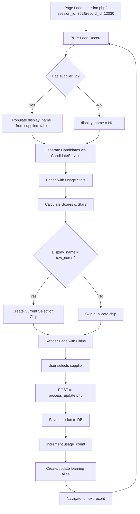

# صفحة اتخاذ القرار (Decision Page)

> **آخر تحديث**: 2025-12-17  
> **النسخة**: 3.0 (PHP Version + Phase 5)  
> **المسار**: `/decision.php`  
> **الملفات الرئيسية**: `www/decision.php`, `www/assets/js/decision.js`

---

## 📋 نظرة عامة

صفحة at خاذ القرار انتقلت من **JavaScript SPA** إلى **PHP-First Architecture** مع تحسينات UX كبيرة.

### ما الجديد في النسخة 3.0؟

1. **Server-Side Rendering**: كل البيانات تُعرض من PHP مباشرة
2. **Usage Tracking & Scoring**: نظام نجوم ⭐⭐⭐ يظهر الأكثر استخداماً
3. **Current Selection Indicator**: Chip أخضر + "📄 من الاكسل" label
4. **Smart Deduplication**: لا تكرار في عرض الأسماء
5. **Learning System Integration**: يحفظ ويتعلم من اختيارات المستخدم

---

## 🎯 الميزات الرئيسية

### 1. عرض السجل الحالي

```
┌────────────────────────────────────────────────┐
│  إحصائيات الجلسة: 150 سجل | 120 معتمد | 30 pending │
├────────────────────────────────────────────────┤
│  📄 الاسم من الاكسل: "ABC TRADING CO."        │ ← جديد!
│  المورد: [شركة ABC للتجارة المحدودة      ]   │
│                                                │
│  Chips:                                        │
│  [✓ شركة ABC - من التعلم] ← Current selection │
│  [⭐⭐⭐ الشركة العربية] ← Most used          │
│  [⭐⭐ شركة ABC الدولية] ← Used before        │
│  [⭐ ABC Trading] ← Dictionary match          │
├────────────────────────────────────────────────┤
│  البنك: [البنك الأهلي السعودي           ]     │
│  Chips: [similar structure]                   │
├────────────────────────────────────────────────┤
│  تفاصيل: المبلغ | الضمان | التاريخ...         │
├────────────────────────────────────────────────┤
│  [← السابق] [حفظ والتالي →] [التالي →]       │
└────────────────────────────────────────────────┘
```

### 2. نظام النجوم (Star Rating System)

**⭐⭐⭐ ثلاث نجوم** (Score ≥ 200):
- استخدمته من قبل
- تطابق عالي
- مستخدم بكثرة

**⭐⭐ نجمتان** (Score 120-199):
- استخدمته مرة
- أو تطابق جيد

**⭐ نجمة واحدة** (Score < 120):
- اقتراح عادي من القاموس
- Fuzzy match

### 3. Current Selection Indicator (Phase 5)

**الهدف**: إظهار ما تم اختياره مسبقاً vs ما في Excel

#### Chip أخضر (Green Chip):
```php
[✓ Selected Name - Badge]

Badges:
- "الاختيار الحالي" ← From dictionary
- "من التعلم" ← From learning system
```

#### Excel Name Label:
```html
📄 من الاكسل: "Original Excel Name"
```
يظهر فقط إذا كان الاسم المختار مختلف عن Excel

#### Smart Deduplication:
```php
if (selected_name === raw_excel_name) {
    // Don't show duplicate green chip
    // Only show Excel name once
}
```

---

## 🔄 تدفق العمل (Workflow)



---

## 💻 الكود الرئيسي

### decision.php - Backend Logic

```php
// 1. Load dependencies
$candidateService = new CandidateService(...);
$supplierLearning = new SupplierLearningRepository();
$normalizer = new Normalizer();

// 2. Get current record
$currentRecord = $records->findById($recordId);

// 3. Generate candidates
$supplierResult = $candidateService->supplierCandidates($currentRecord->rawSupplierName);
$supplierCandidates = $supplierResult['candidates'];

// 4. CRITICAL: Populate display_name BEFORE creating chip
if (!empty($currentRecord->supplierId) && empty($currentRecord->supplierDisplayName)) {
    // Fetch from suppliers table
    $currentRecord->supplierDisplayName = $suppliers->findById($id)['official_name'];
}

// 5. Create current selection chip (if different from Excel)
if ($currentRecord->supplierDisplayName !== $currentRecord->rawSupplierName) {
    array_unshift($supplierCandidates, [
        'supplier_id' => $currentRecord->supplierId,
        'name' => $currentRecord->supplierDisplayName,
        'is_current_selection' => true,
        'selection_badge' => 'من التعلم', // or 'الاختيار الحالي'
        'star_rating' => 3,
        'score' => 1.0,
    ]);
}
```

### Chip Rendering:

```php
<?php foreach (array_slice($supplierCandidates, 0, 6) as $cand): 
    $isCurrentSelection = $cand['is_current_selection'] ?? false;
    $isLearning = $cand['is_learning'] ?? false;
    $starRating = $cand['star_rating'] ?? 1;
    $icon = $isCurrentSelection ? '✓' : str_repeat('⭐', $starRating);
    
    // Current selection: disabled green chip
    if ($isCurrentSelection): ?>
        <button type="button" class="chip-btn chip-selected" disabled>
            <span><?= $icon ?> <?= $cand['name'] ?></span>
            <span class="selection-badge"><?= $cand['selection_badge'] ?></span>
        </button>
        <?php continue; endif;
    
    // Learning: always show
    if ($isLearning): ?>
        <button class="chip-btn chip-learning chip-3star" data-id="<?= $cand['supplier_id'] ?>">
            <?= $icon ?> <?= $cand['name'] ?>
        </button>
        <?php continue; endif;
    
    // Fuzzy: show if < 99% score
    if ($score < 99): ?>
        <button class="chip-btn chip-<?= $starRating ?>star" data-id="<?= $cand['supplier_id'] ?>">
            <?= $icon ?> <?= $cand['name'] ?> <span><?= $score ?>%</span>
        </button>
    <?php endif;
endforeach; ?>
```

---

## 🎨 CSS Styles

```css
/* Current Selection Chip - Green */
.chip-selected {
  background: linear-gradient(135deg, #dcfce7 0%, #bbf7d0 100%);
  border: 2px solid #16a34a;
  color: #166534;
  font-weight: 600;
  cursor: not-allowed;
  box-shadow: 0 2px 8px rgba(22, 163, 74, 0.25);
}

.selection-badge {
  background: #22c55e;
  color: white;
  font-size: 10px;
  padding: 2px 6px;
  border-radius: 8px;
  margin-left: 6px;
}

/* 3-Star Chips - Gold */
.chip-3star {
  background: linear-gradient(135deg, #fef3c7 0%, #fde68a 100%);
  border: 2px solid #f59e0b;
  color: #92400e;
}

/* Learning Chips - Special badge */
.chip-learning::after {
  content: "تعلم";
  font-size: 9px;
  background: #3b82f6;
  color: white;
  padding: 1px 4px;
  border-radius: 4px;
  margin-left: 4px;
}
```

---

## 📡 API Endpoints

| Method | Endpoint | الوصف |
|--------|----------|-------|
| GET | `/decision.php?session_id=X&record_id=Y` | Load decision page |
| POST | `/process_update.php` | Save user decision |
| GET | `/api/suppliers` | Get suppliers dictionary |
| GET | `/api/banks` | Get banks dictionary |
| POST | `/api/suppliers` | Add new supplier |

---

## 🔗 الملفات ذات الصلة

- [`www/decision.php`](../www/decision.php) - Main decision page (PHP)
- [`app/Services/CandidateService.php`](../app/Services/CandidateService.php) - Scoring & enrichment
- [`app/Repositories/SupplierLearningRepository.php`](../app/Repositories/SupplierLearningRepository.php) - Usage tracking
- [`www/assets/css/style.css`](../www/assets/css/style.css) - Chip styles
- [`docs/usage_tracking_system.md`](./usage_tracking_system.md) - Technical spec
- [`docs/03-Matching-Engine.md`](./03-Matching-Engine.md) - Matching algorithms

---

## 📝 سجل التغييرات

### v3.0 (2025-12-17) - Phase 5: Current Selection
- ✅ Added current selection indicator (green chip + badge)
- ✅ Added Excel name display label
- ✅ Smart deduplication (no duplicate chips)
- ✅ Fixed bug: populate display_name before chip creation
- ✅ Fixed bug: undefined $stars variable
- ✅ Fixed bug: missing dependencies

### v2.0 (2025-12-17) - Usage Tracking & Scoring
- ✅ Star rating system (⭐⭐⭐)
- ✅ Usage count tracking
- ✅ Bonus points for frequently used
- ✅ Learning system integration

### v1.0 (2025-12-13) - PHP Migration
- Initial PHP version
- Server-side rendering
- Autocomplete with chips
