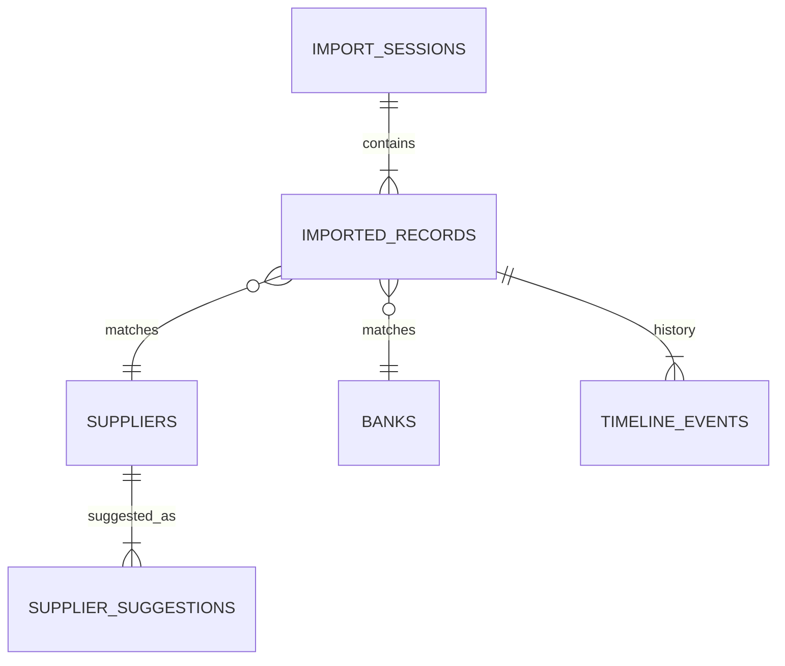

# تصميم قاعدة البيانات (Database Design)

يستخدم النظام قاعدة بيانات **SQLite 3** مدمجة. تم اختيارها لسهولة النقل (Portability) وعدم الحاجة لإعداد خادم معقد، مما يتناسب مع طبيعة التطبيق (Local Self-Hosted).

## 🗄️ الجداول الرئيسية (Main Tables)

### `imported_records`
الجدول المحوري الذي يحوي كافة بيانات الضمانات.

| العمود | النوع | الوصف |
|--------|-------|-------|
| `id` | INTEGER PK | المعرف الفريد |
| `session_id` | INTEGER | رقم جلسة الاستيراد (للتجميع) |
| `guarantee_number` | TEXT | رقم الضمان (مفهرس) |
| `raw_supplier_name` | TEXT | اسم المورد كما جاء من المصدر |
| `supplier_id` | INTEGER | معرف المورد المعتمد (Foreign Key) |
| `match_status` | TEXT | حالة السجل (pending, ready, ...) |
| `snapshot_data` | TEXT | (Legacy) قديم، انتقل لجدول Timeline |

### `guarantee_timeline_events` ⭐
سجل الأحداث التاريخية (Audit Trail).

| العمود | النوع | الوصف |
|--------|-------|-------|
| `id` | INTEGER PK | المعرف |
| `guarantee_number` | TEXT | رقم الضمان المرتبط |
| `event_type` | TEXT | نوع الحدث (import, match, release...) |
| `snapshot_data` | TEXT | نسخة JSON كاملة للسجل لحظة الحدث |
| `created_at` | DATETIME | وقت الحدث |

### `supplier_suggestions` (Learning)
جدول التعلم "الكاش" الذي يحفظ الاقتراحات المحسوبة مسبقاً.

| العمود | النوع | الوصف |
|--------|-------|-------|
| `normalized_input` | TEXT | الاسم الخام بعد التطبيع (مفتاح البحث) |
| `supplier_id` | INTEGER | المورد المقترح |
| `source` | TEXT | مصدر الاقتراح (learning, history...) |
| `total_score` | INTEGER | مجموع نقاط الثقة |
| `usage_count` | INTEGER | عدد مرات استخدام هذا الاقتراح |
| `block_count` | INTEGER | عدد مرات حظر هذا الاقتراح |

---

## 📚 جداول القواميس (Dictionaries)

### `suppliers`
قائمة الموردين المعتمدين.
*   `official_name`: الاسم الرسمي (يظهر في الخطابات).
*   `normalized_name`: الاسم للبحث والمقارنة.

### `banks`
قائمة البنوك المعتمدة.
*   `official_name_ar`: الاسم الرسمي بالعربي.
*   `short_code`: الرمز المختصر (e.g., SNB).

---

## 🔗 العلاقات (Relationships)

---

## 📝 ملاحظات للمطورين

1.  **SQLite Constraints**: قاعدة البيانات تدعم العلاقات (Foreign Keys) لكنها معطلة افتراضياً في بعض النسخ القديمة. النظام يدير التكامل (Integrity) برمجياً في الغالب.
2.  **Indexing**: الحقول المستخدمة في البحث (`guarantee_number`, `normalized_input`) مفهرسة لضمان سرعة الأداء.
3.  **JSON Storage**: نستخدم أعمدة TEXT لتخزين JSON (مثل `snapshot_data`) لأن SQLite مرنة جداً في التعامل مع النصوص الطويلة.
