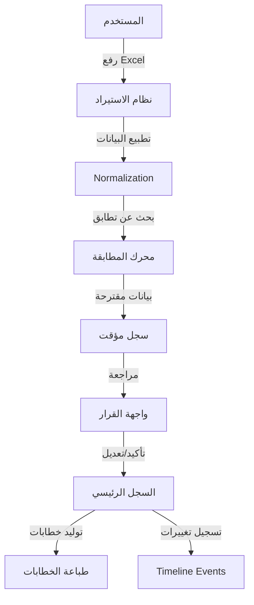

# نظرة عامة على النظام (System Overview)

## 🎯 الهدف من النظام
**نظام إدارة خطابات الضمان (BGL)** هو حل تقني متقدم يهدف إلى تحويل الفوضى في إدارة الضمانات البنكية (ملفات Excel متعددة، بيانات غير موحدة، متابعة يدوية) إلى نظام مركزي، دقيق، ومؤتمت.

يقوم النظام باستقبال البيانات من مصادر متعددة، توحيدها، مطابقتها مع قواعد البيانات المعتمدة، والسماح للمستخدم باتخاذ القرارات النهائية، مع تسجيل دقيق لكل حركة وتغيير يحصل على الضمان.

---

## 🏗️ التقنيات المستخدمة (Technology Stack)

تم بناء النظام ليكون خفيفاً (Lightweight)، سريعاً، وسهل النقل (Portable).

*   **Backend**: PHP 8.2 (Pure PHP, No Frameworks).
*   **Database**: SQLite 3 (Embedded, Serverless).
*   **Frontend**: Vanilla JavaScript (ES6+), CSS3 Variables.
*   **Styling**: Custom CSS System (No heavy CSS frameworks).
*   **Excel Processing**: `shuchkin/simplexlsx` library.

---

## 🔑 المفاهيم الجوهرية (Core Concepts)

### 1. ضمان واحد = سجل واحد
بغض النظر عن عدد مرات استيراد نفس الضمان من ملفات Excel مختلفة، يقوم النظام بدمج المعلومات لضمان وجود **سجل رئيسي واحد (Master Record)** لكل رقم ضمان.

### 2. محرك المطابقة الذكي (Intelligent Matching Engine)
لا يكتفي النظام بمقارنة الأسماء، بل يستخدم خوارزميات للبحث عن التطابق الأقرب (Fuzzy Matching) للموردين والبنوك، مما يقلل الحاجة للإدخال اليدوي.

### 3. التعلم من المستخدم (Learning System)
عندما يقوم المستخدم بتصحيح اسم مورد أو اختياره يدوياً، يقوم النظام "بحفظ" هذا القرار. في المرات القادمة، سيقترح النظام هذا الاختيار تلقائياً.

### 4. سجل الأحداث الزمني (Timeline Events) ⭐
هذه هي الميزة الأحدث والأهم في الإصدار 2.0. أي تغيير يطرأ على الضمان (تغيير مورد، تمديد تاريخ، زيادة مبلغ) لا يتم فقط بتعديل القيمة الحالية، بل يتم تسجيله كـ "حدث" (Event) في سجل تاريخي غير قابل للتعديل. هذا يضمن الشفافية الكاملة والموثوقية.

---

## 🔄 تدفق البيانات (Data Flow)

### مراحل المعالجة:
1.  **الاستيراد (Import)**: قراءة البيانات الخام من Excel.
2.  **التطبيع (Normalization)**: تنظيف النصوص (إزالة المسافات، توحيد الأحرف).
3.  **المطابقة (Matching)**: مقارنة النصوص مع قواميس الموردين والبنوك.
4.  **القرار (Decision)**: تدخل المستخدم للموافقة أو التعديل (إذا لزم الأمر).
5.  **الحفظ (Persist)**: حفظ البيانات النهائية في قاعدة البيانات وتسجيل الحدث.

---

## 💡 فلسفة التصميم

*   **السرعة أولاً**: واجهات سريعة الاستجابة تعتمد على AJAX وتحديثات جزئية.
*   **البساطة**: تجنب التعقيد البرمجي غير الضروري (Keep It Simple).
*   **الشفافية**: كل قرار مسجل، وكل تغيير معروف المصدر والوقت.
*   **الموثوقية**: البيانات في قاعدة البيانات هي الحقيقة الوحيدة (Single Source of Truth).
