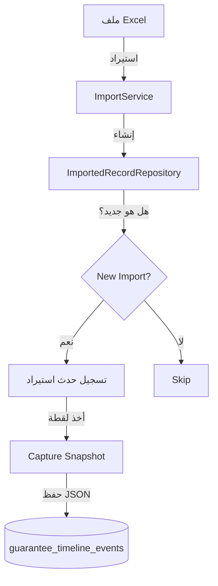

# سجل الأحداث الزمني (Timeline Events)

## 🌟 نظرة عامة
نظام **Timeline Events** هو القلب النابض للشفافية في النظام. يقوم بتتبع وتسجيل كل تغيير يطرأ على سجل الضمان منذ لحظة استيراده وحتى الإفراج عنه.

سابقاً، كان النظام يحتفظ فقط بـ "الحالة الحالية". الآن، يحتفظ النظام بـ "قصة حياة" كل ضمان.

---

## 💎 المميزات الرئيسية
1.  **تتبع كامل (Full Audit Trail)**: معرفة من قام بالتغيير، متى، وما هي القيم القديمة والجديدة.
2.  **اللقطات التاريخية (Snapshots)**: حفظ نسخة كاملة من بيانات الضمان عند كل حدث هام (مما يسمح بإعادة طباعة الخطابات كما كانت في الماضي).
3.  **الشفافية**: توضيح الفرق بين البيانات القادمة من Excel (الخام) والبيانات المعتمدة في النظام.

---

## 📊 أنواع الأحداث (Event Types)

| الحدث (Event) | البادج | الوصف | متى يحدث؟ |
|---------------|--------|-------|-----------|
| `import` | استيراد | إنشاء السجل لأول مرة | عند رفع ملف Excel |
| `status_change` | مطابقة | ربط السجل بمورد/بنك | عند المطابقة الآلية أو اليدوية |
| `supplier_change` | ✏️ تعديل | تغيير المورد يدوياً | عند تعديل المورد في واجهة القرار |
| `extension` | تمديد | تسجيل تمديد للضمان | عند النقر على "تمديد" |
| `release` | إفراج | إنهاء الضمان | عند إصدار خطاب إفراج |

---

## 🏗️ البنية التقنية (Architecture)

### تدفق البيانات (Data Flow)

### هيكل قاعدة البيانات
يتم تخزين الأحداث في جدول `guarantee_timeline_events`:

*   `guarantee_number`: رقم الضمان (المفتاح الرئيسي للتجميع).
*   `event_type`: نوع الحدث.
*   `snapshot_data`: عمود نصي يحتوي على بيانات JSON للسجل في تلك اللحظة.
*   `old_value` / `new_value`: للتغييرات البسيطة (مثل تغيير مبلغ).

---

## 📸 آلية اللقطات (Snapshots)

**اللقطة (Snapshot)** هي نسخة مجمدة من بيانات الضمان.
*   **لماذا؟** لنفترض أن اسم المورد تغير اليوم. إذا أردنا طباعة خطاب قديم صدر قبل شهر، يجب أن يظهر بالاسم القديم. اللقطات تضمن ذلك.
*   **كيف؟** يتم تخزين صف السجل كاملاً كـ JSON داخل حدث الـ Timeline.

---

## 🔄 دورة حياة الضمان (Lifecycle Example)

1.  **الاستيراد**: يتم إنشاء حدث `import`. البيانات تظهر كما هي في Excel (مثلاً: "SNB").
2.  **المطابقة**: يكتشف النظام أن "SNB" هو "البنك الأهلي السعودي". يتم إنشاء حدث `status_change` يوضح التحول من "SNB" → "البنك الأهلي".
3.  **التعديل**: يلاحظ المستخدم خطأ في المبلغ ويعدله. يتم إنشاء حدث `amount_change`.
4.  **الإفراج**: ينتهي الغرض من الضمان. يقوم المستخدم بإصدار إفراج. يتم إنشاء حدث `release` ويتحول السجل للأرشيف.
