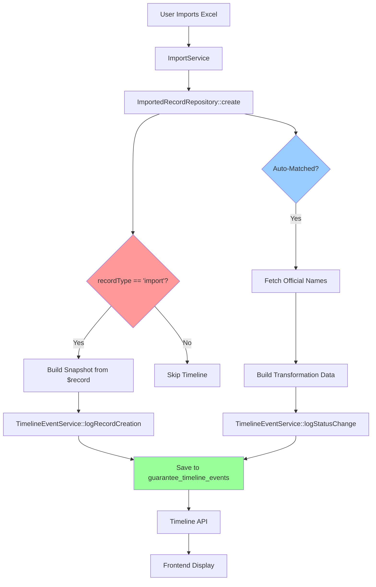
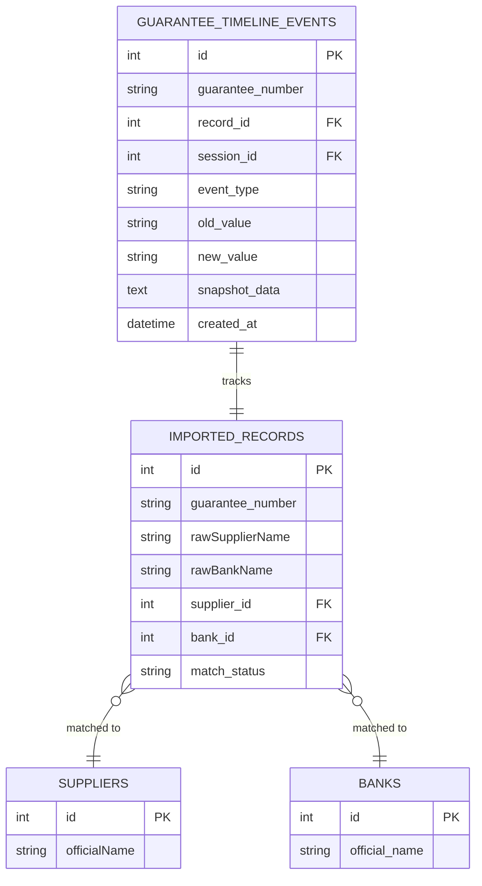
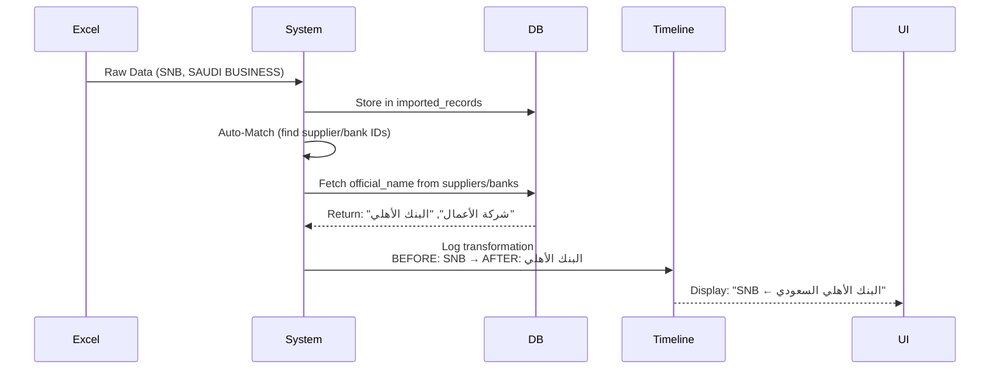
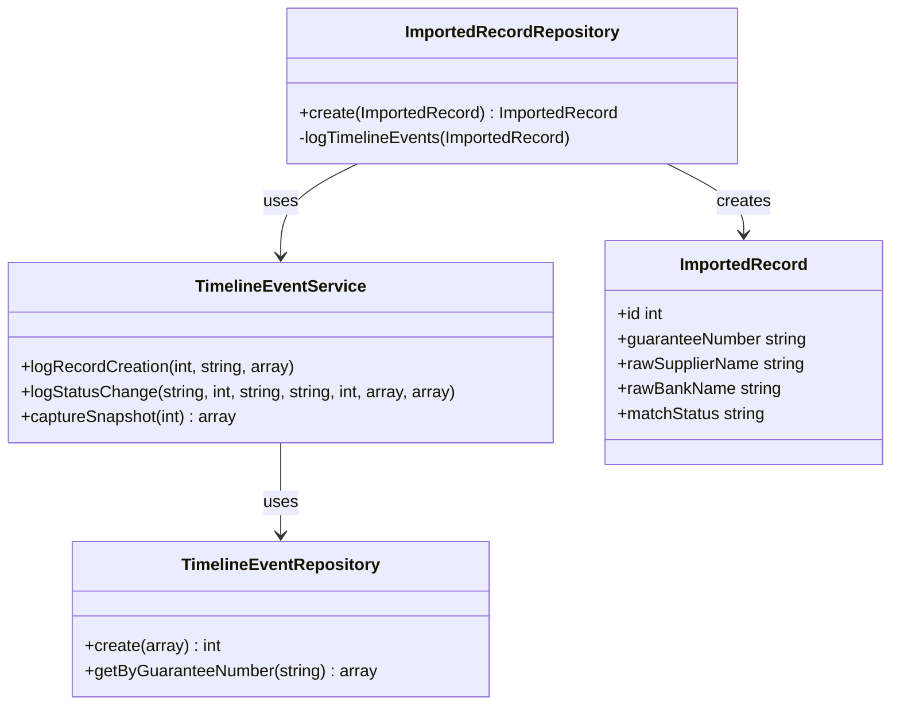

# Timeline Events System - Architecture Diagram

## System Flow

```mermaid
graph TB
    A[User Imports Excel] --> B[ImportService]
    B --> C[ImportedRecordRepository::create]
    C --> D{recordType == 'import'?}
    D -->|Yes| E[Build Snapshot from $record]
    D -->|No| Z[Skip Timeline]
    E --> F[TimelineEventService::logRecordCreation]
    F --> G[Save to guarantee_timeline_events]
    
    C --> H{Auto-Matched?}
    H -->|Yes| I[Fetch Official Names]
    I --> J[Build Transformation Data]
    J --> K[TimelineEventService::logStatusChange]
    K --> G
    
    G --> L[Timeline API]
    L --> M[Frontend Display]
    
    style D fill:#ff9999
    style H fill:#99ccff
    style G fill:#99ff99
```

## Data Structure

```mermaid
erDiagram
    GUARANTEE_TIMELINE_EVENTS {
        int id PK
        string guarantee_number
        int record_id FK
        int session_id FK
        string event_type
        string old_value
        string new_value
        text snapshot_data
        datetime created_at
    }
    
    IMPORTED_RECORDS {
        int id PK
        string guarantee_number
        string rawSupplierName
        string rawBankName
        int supplier_id FK
        int bank_id FK
        string match_status
    }
    
    SUPPLIERS {
        int id PK
        string officialName
    }
    
    BANKS {
        int id PK
        string official_name
    }
    
    GUARANTEE_TIMELINE_EVENTS ||--|| IMPORTED_RECORDS : "tracks"
    IMPORTED_RECORDS }o--|| SUPPLIERS : "matched to"
    IMPORTED_RECORDS }o--|| BANKS : "matched to"
```

## Event Timeline Example

```mermaid
gantt
    title Timeline Events for Record LG123
    dateFormat  HH:mm:ss
    section Import
    Excel Import           :done, 10:00:00, 1s
    Create Record          :done, 10:00:01, 1s
    Log Import Event       :done, 10:00:02, 1s
    section Matching
    Auto-Match Detection   :done, 10:00:02, 1s
    Fetch Official Names   :done, 10:00:03, 1s
    Log Status Change      :done, 10:00:03, 1s
    section Display
    API Fetches Timeline   :active, 10:00:10, 1s
    Render in UI           :active, 10:00:11, 1s
```

## Snapshot Transformation

```mermaid
sequenceDiagram
    participant Excel
    participant System
    participant DB
    participant Timeline
    
    Excel->>System: Raw Data (SNB, SAUDI BUSINESS)
    System->>DB: Store in imported_records
    System->>System: Auto-Match (find supplier/bank IDs)
    System->>DB: Fetch official_name from suppliers/banks
    DB-->>System: Return: "شركة الأعمال", "البنك الأهلي"
    System->>Timeline: Log transformation<br/>BEFORE: SNB → AFTER: البنك الأهلي
    Timeline-->>UI: Display: "SNB ← البنك الأهلي السعودي"
```

## Class Relationships

```mermaid
classDiagram
    class ImportedRecordRepository {
        +create(ImportedRecord) ImportedRecord
        -logTimelineEvents(ImportedRecord)
    }
    
    class TimelineEventService {
        +logRecordCreation(int, string, array)
        +logStatusChange(string, int, string, string, int, array, array)
        +captureSnapshot(int) array
    }
    
    class TimelineEventRepository {
        +create(array) int
        +getByGuaranteeNumber(string) array
    }
    
    class ImportedRecord {
        +id int
        +guaranteeNumber string
        +rawSupplierName string
        +rawBankName string
        +matchStatus string
    }
    
    ImportedRecordRepository --> TimelineEventService : uses
    TimelineEventService --> TimelineEventRepository : uses
    ImportedRecordRepository --> ImportedRecord : creates
```
